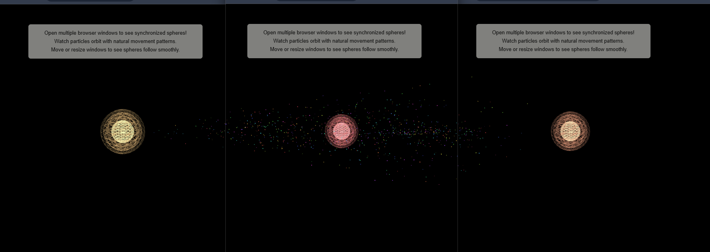

# Multiple Window 3D Scene using Three.js




## Introduction
This project demonstrates a unique approach to creating and managing a 3D scene across multiple browser windows using Three.js and localStorage. It features dynamic spheres that synchronize across windows, with thousands of small orbiting spheres that exhibit natural movement patterns inspired by elements in nature. The project is designed for developers interested in advanced web graphics, window management techniques, and organic animation systems.

The image above shows three synchronized browser windows, each displaying a unique multi-layered wireframe sphere with a volumetric glow effect, surrounded by orbiting particles that create a dynamic, living particle system.

## Features
- 3D scene creation and rendering with Three.js.
- Synchronization of 3D scenes across multiple browser windows.
- Dynamic window management and state synchronization using localStorage.
- **Main Spheres**: Each browser window displays a unique wireframe sphere that follows the window's position and size.
- **Orbiting Spheres**: Thousands of small spheres (2000 by default) that orbit around the main spheres with natural, organic movement patterns.
- **Natural Movement Algorithm**: Small spheres exhibit natural behavior inspired by elements in nature:
  - Spheres rotate around their center when within a safe distance
  - When they drift too far from the center (beyond maximum distance), they automatically move back toward a random position near the center
  - This creates a dynamic, living system that mimics natural particle behavior
- **Multi-Window Synchronization**: All orbiting spheres are shared across all windows via localStorage, ensuring consistent state and behavior.
- **Dynamic Target Following**: When new windows are added, all orbiting spheres smoothly transition to orbit around the latest sphere without sudden jumps.

## Installation
Clone the repository:

```
git clone https://github.com/techspire0924/multiWindow3dScene
```

## Running the Application

**Important:** This project uses ES6 modules, which require a local web server to run. You cannot simply open `index.html` directly in your browser due to CORS restrictions.

### Option 1: Using Python (Recommended)
If you have Python installed, navigate to the project directory and run:

```bash
# Python 3
python -m http.server 8000

# Python 2
python -m SimpleHTTPServer 8000
```

Then open `http://localhost:8000` in your browser.

### Option 2: Using Node.js
If you have Node.js installed, you can use `npx` to run a simple server:

```bash
npx serve
```

Or install `http-server` globally:
```bash
npm install -g http-server
http-server
```

### Option 3: Using VS Code
If you're using Visual Studio Code, install the "Live Server" extension and click "Go Live" in the status bar.

## Usage
The main application logic is contained within `main.js` and `WindowManager.js`. The 3D scene is rendered in `index.html`, which serves as the entry point of the application.

### Configuration
You can customize the orbiting spheres system by modifying constants in `main.js`:
- `ORBITER_COUNT`: Number of orbiting spheres (default: 2000)
- `ORBITER_MIN_DISTANCE`: Minimum orbital distance (default: 50)
- `ORBITER_MAX_DISTANCE`: Maximum orbital distance before return movement triggers (default: 250)

### Multi-Window Experience
1. Open the application in your browser
2. Open additional windows - each new window will display its own main sphere
3. All orbiting spheres will automatically transition to orbit around the latest sphere
4. Move and resize windows to see the spheres smoothly follow their positions
5. Watch as spheres naturally drift and return, creating an organic, living particle system

## Structure and Components
- `index.html`: Entry point that sets up the HTML structure and includes the Three.js library and the main script.
- `WindowManager.js`: Core class managing window creation, synchronization, and state management across multiple windows.
- `main.js`: Contains the logic for initializing the 3D scene, handling window events, and rendering the scene.
- `three.r124.min.js`: Minified version of the Three.js library used for 3D graphics rendering.

## Detailed Functionality

### Window Management
- `WindowManager.js` handles the lifecycle of multiple browser windows, including creation, synchronization, and removal. It uses localStorage to maintain state across windows.

### 3D Scene and Spheres
- `main.js` initializes the 3D scene using Three.js, manages the window's resize events, and updates the scene based on window interactions.
- **Main Spheres**: Each window displays a wireframe sphere that smoothly follows the window's center position. Spheres are color-coded based on their window index.
- **Orbiting Spheres System**: 
  - Created only once when the first window appears, then shared across all windows via localStorage
  - Each orbiter has unique properties: rotation speed, distance, color, and movement speed
  - Orbiters dynamically track and follow their target sphere's center position

### Natural Movement Behavior
The small orbiting spheres implement a natural movement algorithm that mimics organic particle behavior:

1. **Orbital Rotation**: When within the maximum distance from center, spheres rotate in spherical orbits around their center point using spherical coordinates (theta and phi angles).

2. **Automatic Return**: When a sphere drifts beyond the maximum distance (250 units by default), it automatically:
   - Sets a random target position within 10 units of the center
   - Moves directly toward that target position
   - Returns to orbital rotation once it reaches the target

3. **Center Synchronization**: The center point of each orbiter smoothly follows its target sphere's position, ensuring orbiters stay synchronized with their assigned window sphere even as windows move or resize.

This creates a living, breathing particle system where spheres naturally maintain their position around the center while allowing for organic drift and return patterns, similar to how particles behave in natural systems like molecular structures or celestial bodies.

## Contributing
Contributions to enhance or expand the project are welcome. Feel free to fork the repository, make changes, and submit pull requests.

## License
This project is open-sourced under the MIT License.
